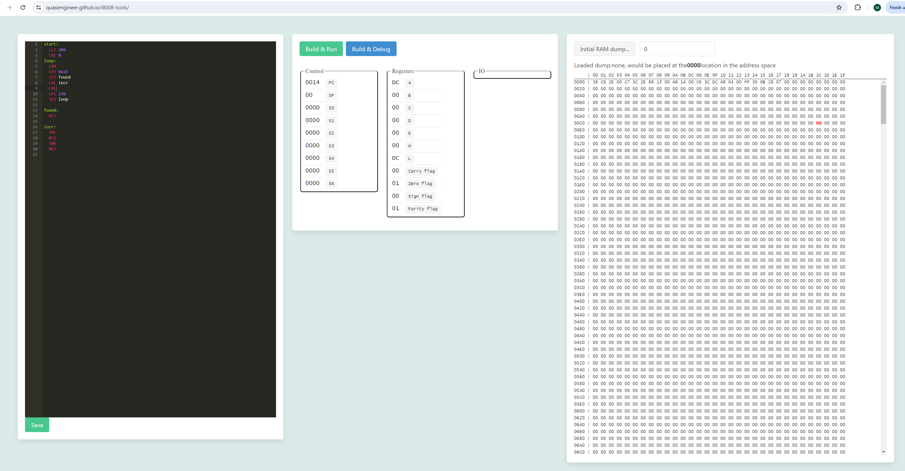

# i8008-tools
Toolchain for development for Intel 8008 systems

Hosted version of emulator could be found [there](https://quasiengineer.github.io/i8008-tools/).



# Assembly

## Installation

Install globally:

```sh
npm install -g i8008-asm
```

## Usage

Compiles `program.i8008` into ROM image and store it into `program.bin`

```sh
i8008-asm program.i8008 program.bin 
```

You can omit output file name, in that case assembler would replace extension of input file name to `.bin`

## Assembly Syntax

Comments started with `#`:
```
# comment
```

Labels could be used:
```
label:
  NOP
label2: INL
```

Each instruction should be on separate line and can have optional operand:
```
  instruction
  instruction operand
```

Operand could be one of the kind:
- 8-bit immediate value (in both hexadecimal and decimal forms)
- 14-bit address (in both hexadecimal and decimal forms)
- label name

List of instructions could be found [here](https://en.wikichip.org/wiki/intel/mcs-8/isa).

Sample program (writes specific values to RAM up to 0x4000 and then reads and verifies them back):
```
write_incH: LHI 0x01
            LLI 0x00
write_incL: LMH
            INL
            LML
            INL
            JFZ write_incL
            INH
            LAH
            CPI 0x40
            JFZ write_incH
            LHI 0x01
read_incH:  LLI 0x00
read_incL:  LAM
            CPH
            JFZ error
            INL
            LAM
            CPL
            JFZ error
            INL
            JFZ read_incL
            INH
            LAH
            CPI 0x40
            JFZ read_incH
            LHI 0x00
error:      LAH
            OUT 8
            HLT
```

## Module/Programmatic Usage

i8008-asm can be used as a module:

```js
import { compile } from 'i8008-asm';

const { bytecode, errors, symbols } = compile('HLT');
if (errors?.length) {
  console.log('COULD NOT PARSE SOURCE CODE!');
  console.log(errors);
  process.exit(1);
}

console.log(`First byte of ROM is ${bytecode[0]}`);
```

# Preprocessor

Could be used before compilation and provides two main features.

### Modularity

Allows to merge several physical files into single compilation target:

```
# foo.i8008

foo:
  LHI 0x10
  RET
```

```
# main.i8008

%include "foo.i8008"

main:
  CAL foo
  HLT
```

And after preprocessing `main.i8008` we can successfully compile whole program.

### Macro

Another useful feature is support for macros.
```
%define FOO 1

main:
  LAI $FOO
  HLT
```

# Emulator

## UI

Just run default web-server and open http://localhost:1234 in browser.
```sh
npm run serve
```

## Module/Programmatic Usage

```js
import Emulator from 'i8008-emu';

const system = new Emulator({ memoryDump: romDump });

const { registers } = system;
registers.B = 1;

while (!system.isFinished) {
  system.instruction();
}

console.log(`Program has finished, final value of register A is ${registers.A}`);
```
